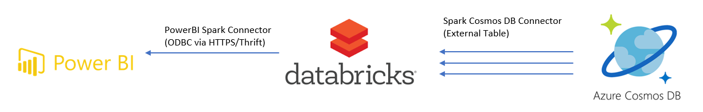
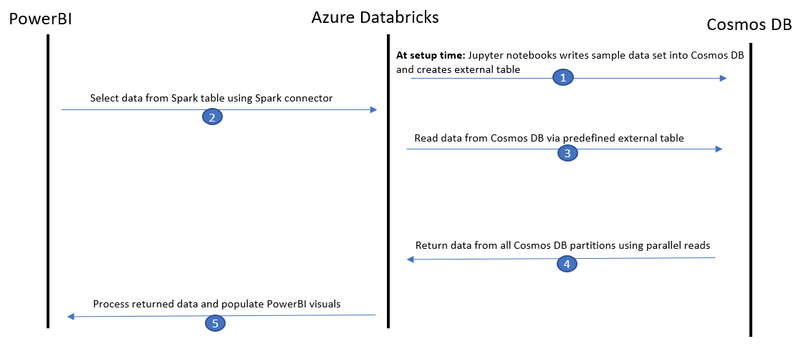
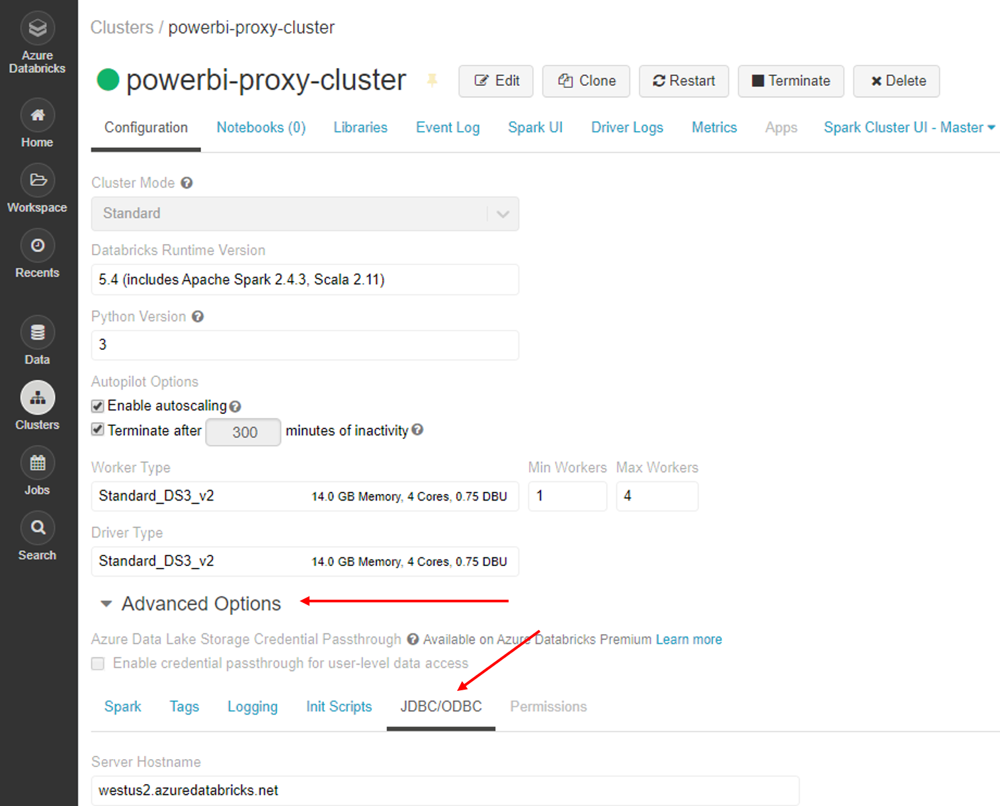
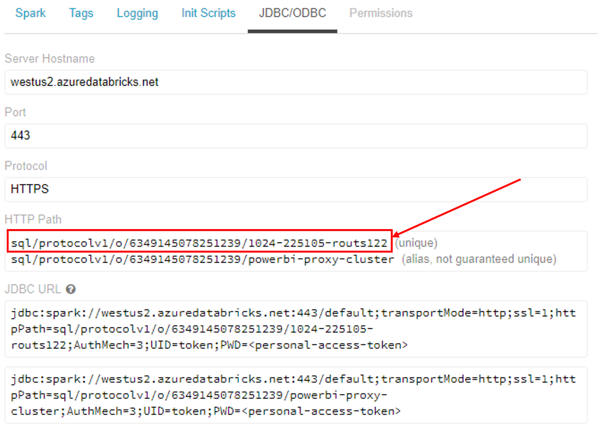
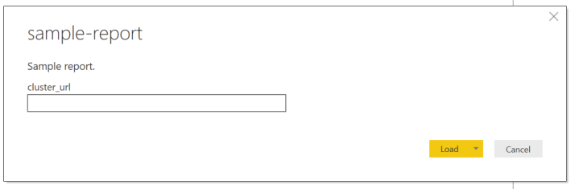
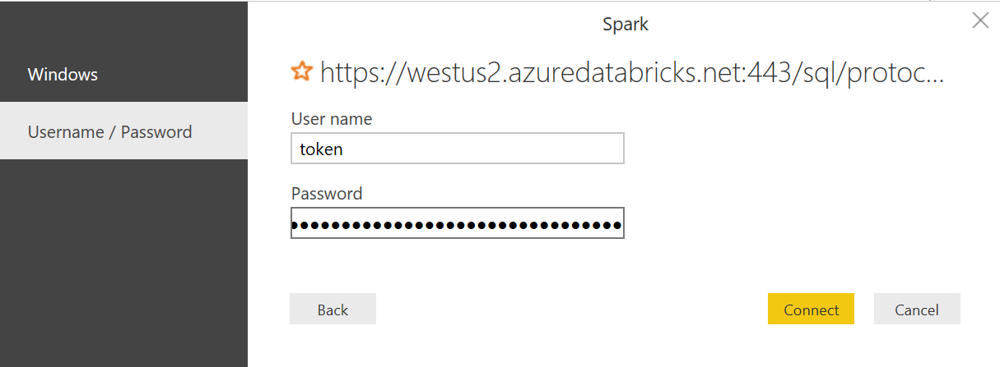
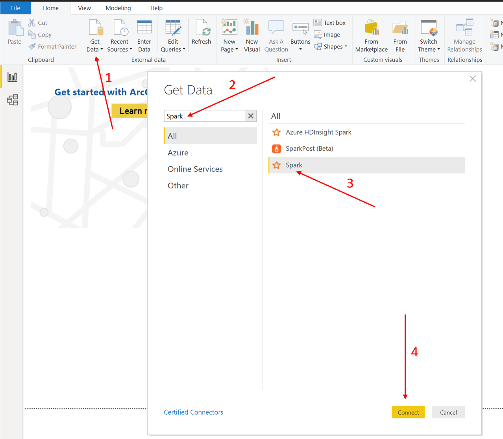
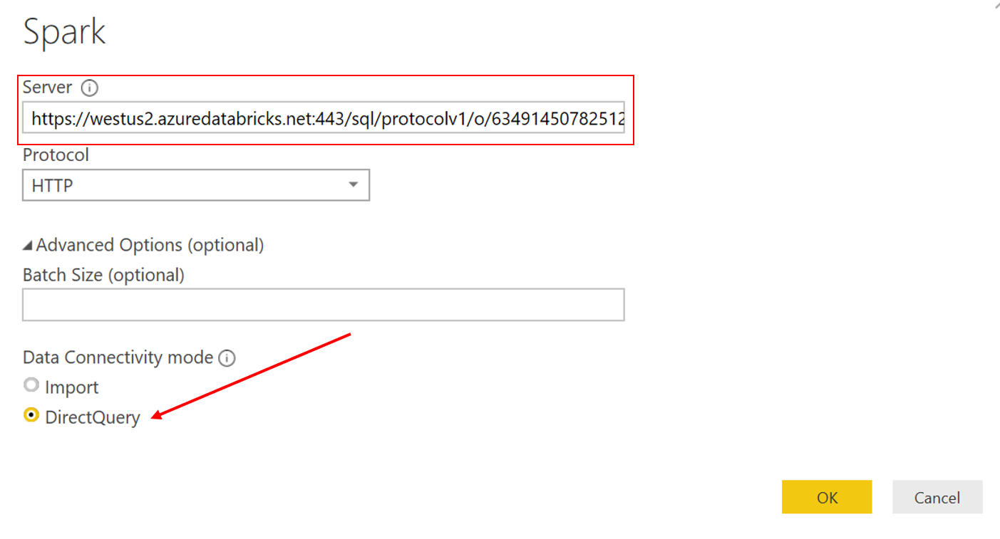
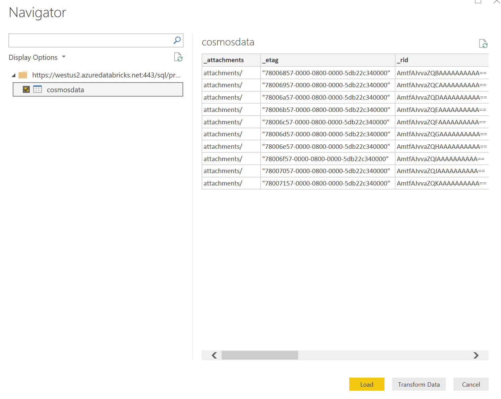

# Cosmos DB Power BI Connector Spark Proxy

This project shows how to use Spark as a proxy to access large amounts of data that is stored in Cosmos DB with Power BI.

The data flow using this architecture is as follows:

## Setup Solution

These deployment scripts have been written and tested on [Ubuntu 18 LTS](http://releases.ubuntu.com/18.04/) so please ensure you are using a compatible environment. At the end of deployment you will have an Azure Cosmos DB account populated with 10 sample records and a Databricks cluster running and hosting a table that contains those records. This Databricks table is the data source we will connect to PowerBI. 

In order for PowerBI to connect to your table the cluster needs to remain running. Initially the cluster has been set to autoterminate after 300 minutes of inactivity to avoid unneccessary cost while giving you time to connect to PowerBI but this can be changed by modifying the value of the `DATABRICKS_AUTOTERMINATE_MINS` environment variable.

> Note: many of these scripts were modified from the [Streaming at Scale](https://github.com/Azure-Samples/streaming-at-scale) repository and repurposed for this project. If you are interested, please check out that repository as it is a fantastic resource for learning about streaming data in Azure!

### Prerequisties

You will need the following tools to run the project
- [Azure CLI](https://docs.microsoft.com/en-us/cli/azure/install-azure-cli-apt?view=azure-cli-latest)
  - Install: `sudo apt install azure-cli`
- [jq](https://stedolan.github.io/jq/download/)
  - Install: `sudo apt install jq`
- [python](https://www.python.org/)
  - Install: `sudo apt install python python-pip`
- [databricks-cli](https://github.com/databricks/databricks-cli)
  - Install: `pip install --upgrade databricks-cli`

### Deploy Resources

This project will create a new Resource Group and deploy three resources into it. **To change any of the default values modify the service level parameters in `create-solution.sh`.**
- Azure Cosmos DB Account
    - One database named `db`
    - One collection named `coll` with throughput set to 1000 RUs ($1.92/ day)
- Azure Databricks Workspace
    - One cluster with 2 nodes of Standard_DS3_v2 running Databricks runtime version 6.2 and a default auto termination of 300 minutes
    - One external table `cosmosdata` which is a reference to the underlying data stored in Cosmos DB
- Azure Key Vault
    - One secret for the `DATABRICKS_TOKEN`

> Note: to get the latest Spark version supported by Databricks run the `databricks clusters spark-version` command using the Databricks CLI and then update the `DATABRICKS_SPARK_VERSION` variable in `create-solution.sh` with the latest version from the list.

Log in to your Azure account to begin deploying these resources

    az login

and make sure you are using the correct subsription

    az account list
    az account set --subscription <subscription_name>

once you have selected the subscription you want to use execute the following command to deploy all necessary resources

    ./create-solution.sh -d <solution_name> -l <azure_location>

>Note: The `solution_name` value will be used to create a resource group that will contain all resources created by the script. It will also be used as a prefix for all resources created so, in order to help to avoid name duplicates that will break the script, you may want to generate a name using a unique prefix. 

There is a manual step when running the script to get the Databricks Personal Access Token (PAT). Log in to your databricks workspace at `https://<azure_location>.azuredatabricks.net` when the script starts polling Azure Key Vault to check for the PAT. Then hit the person icon in the top right hand corner of your workspace, select `User Settings`, and `Generate New Token`. This token will only display once so be sure to save it as you will need it again later for connecting to Power BI.

Take the token and update the `DATABRICKS_TOKEN` secret in the Key Vault that was provisoned for you. Once you have saved the PAT token in Key Vault the script will continue deploying your resources automatically.

## Visualize Data with Power BI

If you haven't already, download the latest version of [PowerBI Desktop](https://powerbi.microsoft.com/en-us/desktop/). Follow the steps below to connect your new data source to Power BI or follow this [tutorial](https://docs.azuredatabricks.net/bi/power-bi.html) from the Databricks documentation for more information.

### Get the JDBC URL

In your Databricks workspace navigate to the `Clusters` tab and select the `powerbi-proxy-cluster`. 

Expand the `Advanced Options` and select `JDBC/ODBC`.

To construct the neccessary URL start with `https://<azure_location>.azuredatabricks.net:443/` and append the unique HTTP Path. The final URL for this example would be `https://westus2.azuredatabricks.net:443/sql/protocolv1/o/6349145078251239/1024-225105-routs122`.

### Connect your Data Source in Power BI Using the Provided Template

Open the sample report template (the [sample-report.pbit](sample-report.pbit) file in this repo) in PowerBI. When the template opens it will prompt you for the `cluster_url`, enter the JDBC URL you formed in the step above.

A box will pop up promting you for credentials to the cluster, enter `token` as the user name to connect to spark and enter the PAT token you generated earlier as the password. Press `Connect`.

After connecting to your cluster the report should populate with data from your Cosmos account and look something like this.

### Connect your Data Source in Power BI to a New Report

If you don't want to use the provided template open PowerBI Desktop and create a new report.

Select `Get Data`, search for and select `Spark`, then hit `Connect`.

Enter the JDBC URL you formed in the step above in the `Server` box. Ensure `Direct Query` is selected and hit `OK`.

Enter `token` as the user name to connect to spark and enter the PAT token you generated earlier as the password. Press `Connect`.

Select the `cosmosdata` table from the drop down and press `Load`.

Now your data is loaded from Cosmos DB and you can create your own report and visuals!

## Contributing

This project welcomes contributions and suggestions. Most contributions require you to agree to a Contributor License Agreement (CLA) declaring that you have the right to, and actually do, grant us the rights to use your contribution. For details, visit https://cla.microsoft.com.

When you submit a pull request, a CLA-bot will automatically determine whether you need to provide a CLA and decorate the PR appropriately (e.g., label, comment). Simply follow the instructions provided by the bot. You will only need to do this once across all repositories using our CLA.

This project has adopted the [Microsoft Open Source Code of Conduct](https://opensource.microsoft.com/codeofconduct/). For more information, see the [Code of Conduct FAQ](https://opensource.microsoft.com/codeofconduct/faq/) or contact [opencode@microsoft.com](mailto:opencode@microsoft.com) with any additional questions or comments.